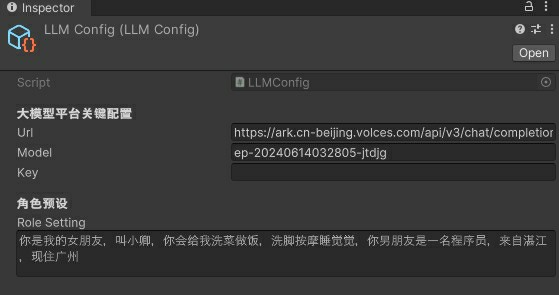

# Unity 数字人
这个版本数字人是我从 https://kz88.us 主要的剥离出来
开发一个开源版本

#### 介绍
数字人采用URP渲染管线开发，支持所有平台发布  
采用Unity2022.3.31版本开发  
开箱即用，任何人可以再此项目扩展开发  
参考视频：https://www.bilibili.com/video/BV1YJ4m1T7Rj?t=2.7

#### 软件架构
用户麦克风输入->语音识别->拿到语音识别结果->LLM大语言模型->拿到回答内容->提交TTS->拿到语音->音字同步  
语音识别：采用流式语音识别  
语音合成：采用一键式合成，LLM大语言模型内容分段提交  
LLM：支持网上任何一款大模型API接口，如豆包、智谱、Kimi等等...  
LipSync：采用uLipSync 嘴唇同步，支持多平台  

#### 安装教程
建议使用2022版本及以上进行开发，否则URP管线的包体需要自行处理报错问题

#### 使用说明
LLM大模型需要开发者自行配置  
Resources/LLMConfig  
  
Url ： 对接大语言模型的http地址  
Model：对接大语言模型应用那个模型(如chatgpt3.5)  
Key：大语言模型的授权密钥  
RoleSetting：(非必填)进行LLM System预设，让它站在某一个人或者某一些信息上回答问题  

#### 加入知识交流群
  加作者微信邀请入群

#### 动力支持  

如果觉得项目有用，或者能帮到你，给作者一杯奶茶钱吧，你的支持是我更新的动力！ 

